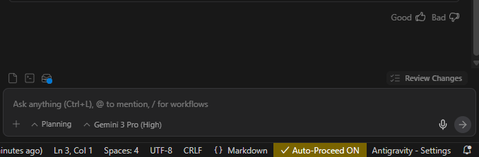

# Auto Proceed Extension

Marketplace extension link: https://marketplace.visualstudio.com/items?itemName=ricco6.auto-proceed

Automatically confirms command execution prompts in Antigravity so you don't have to click/press Alt+Enter.
You can still write text while the toggle is ON; meaning leaving it always ON is fine.

## Installation

### From VS Code Marketplace
[Download here](https://marketplace.visualstudio.com/items?itemName=ricco6.auto-proceed)

### Manual Installation
1. Download the latest `.vsix` file from the [Releases page](https://github.com/ricco6/always-accept-ag/releases).
2. Drag and drop the file into your editor's Extensions view.
3. Reload the window.

## Usage

1. Click **Auto-Proceed OFF** in the status bar to toggle it **ON**.
2. Handles the toggle per-window as well; meaning you can disable/enable it on specific windows of Antigravity.

## Warning

This allows the AI to run commands automatically. Use responsibly.

## License

MIT License - See [LICENSE](https://github.com/ricco6/always-accept-ag/blob/master/LICENSE) for details.
